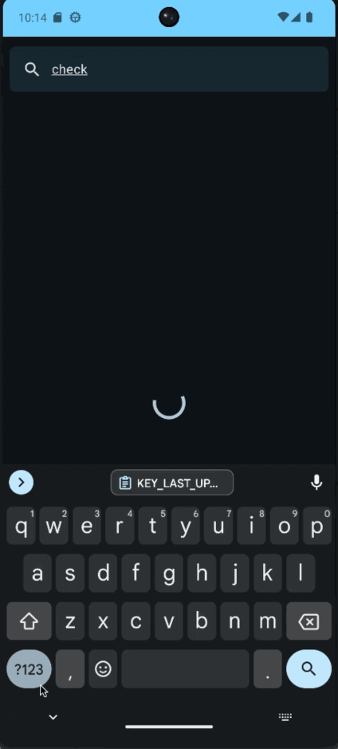
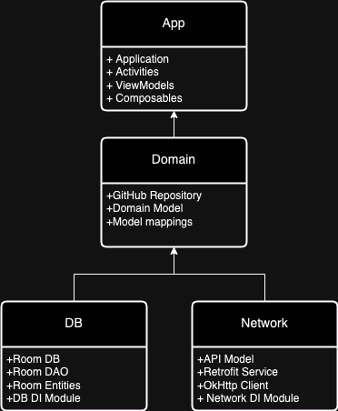

# Github Browser Sample - Clean Modular Architecture
This is a basic demo app, to demonstrate a barebones modular architecture with the latest Android tech stack(as of 2024):
- Retrofit/OkHttp for Networking
- Room DB
- Dagger/Hilt DI
- Kotlin Coroutines
- AndroidX + Compose for UI

## Clean Architecture Notes
The goal is to make the project modular, without overdoing it by creating unnecessary extra modules and without importing unnecessary dependencies.

